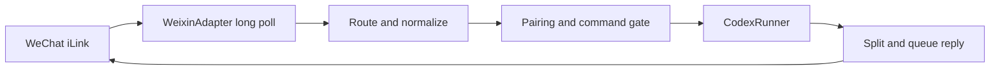

# Architecture

The bridge has four small layers:

1. `WeixinClient` talks to the iLink bot endpoints for QR login, long polling, and text sending.
2. `WeixinAdapter` converts raw WeChat messages into stable inbound route objects, downloads inbound media, sends typing state, and serializes outbound text delivery.
3. `WechatCodexBridge` handles pairing, group triggers, commands, per-chat route state, and Codex task dispatch.
4. `CodexRunner` starts `codex exec` or `codex exec resume`, reads JSONL output, stores the thread id, and returns the final assistant text to WeChat.

State is intentionally boring:

- accounts: `WECHAT_CODEX_HOME/state/weixin/accounts/*.json`
- routes: `WECHAT_CODEX_HOME/state/bridge-state.json`
- per-route fields: route key, trusted flag, Codex thread id, cwd, last prompt, latest WeChat context token, timestamps

The route key format is:

```text
weixin:<accountId>:<direct|group>:<conversationId>
```

This gives every private chat or group chat its own Codex thread by default. `/new` clears the stored thread id for the current route. `/cwd` changes only that route's working directory.

## Message Flow



## Design Choices

- Pairing is required by default because a WeChat chat can trigger local Codex work.
- Group prompts require `WECHAT_CODEX_GROUP_TRIGGER` by default; commands still use `/...`.
- The latest inbound WeChat `context_token` is cached per route and echoed in outbound replies, matching Tencent's plugin protocol contract.
- Inbound media is downloaded and AES-128-ECB decrypted when `WECHAT_CODEX_DOWNLOAD_MEDIA=true`; Codex receives local paths in the prompt metadata.
- Outbound media upload is intentionally deferred because it requires the full `getuploadurl -> encrypted CDN upload -> media item send` pipeline.
